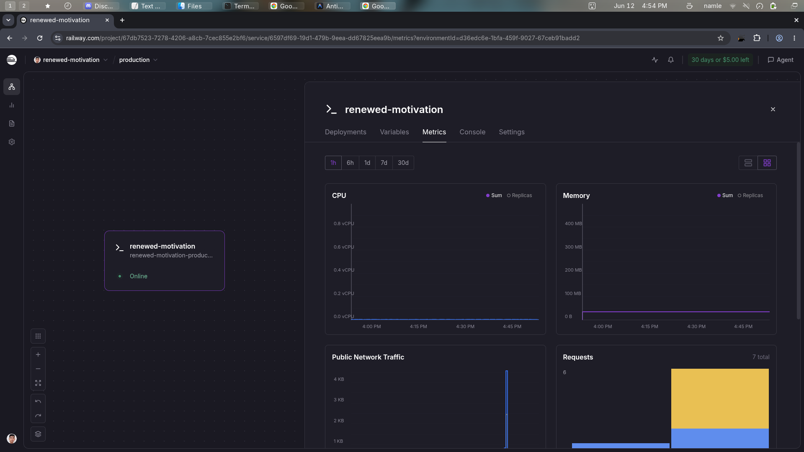
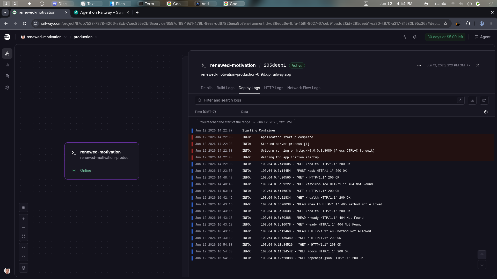
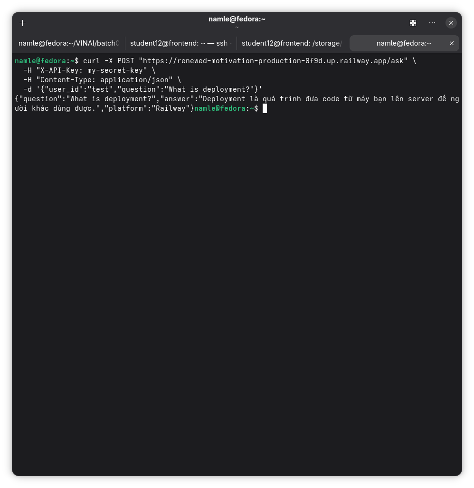

# Deployment Information

## Public URL
https://renewed-motivation-production-0f9d.up.railway.app/

## Platform
Railway

## Test Commands

Set the values first:

```bash
export URL="https://renewed-motivation-production-0f9d.up.railway.app/"
export AGENT_API_KEY="my-secret-key"
```

### Health Check

```bash
curl "$URL/health"
```

Expected: HTTP 200 with `"status":"ok"`.

### Readiness Check

```bash
curl "$URL/ready"
```

Expected: HTTP 200 when Redis is reachable.

### Authentication Required

```bash
curl -X POST "$URL/ask" \
  -H "Content-Type: application/json" \
  -d '{"user_id":"test","question":"Hello"}'
```

Expected: HTTP 401.

### API Test

```bash
curl -X POST "$URL/ask" \
  -H "X-API-Key: $AGENT_API_KEY" \
  -H "Content-Type: application/json" \
  -d '{"user_id":"test","question":"Hello"}'
```

Expected: HTTP 200 with an `answer`.

### Rate Limiting

```bash
for i in $(seq 1 15); do
  curl -s -o /dev/null -w "%{http_code}\n" -X POST "$URL/ask" \
    -H "X-API-Key: $AGENT_API_KEY" \
    -H "Content-Type: application/json" \
    -d "{\"user_id\":\"rate-test\",\"question\":\"test $i\"}"
done
```

Expected: the first 10 requests return 200, then requests return 429.

### Conversation History

```bash
curl -X POST "$URL/ask" \
  -H "X-API-Key: $AGENT_API_KEY" \
  -H "Content-Type: application/json" \
  -d '{"user_id":"history-test","question":"My name is Alice"}'

curl -X POST "$URL/ask" \
  -H "X-API-Key: $AGENT_API_KEY" \
  -H "Content-Type: application/json" \
  -d '{"user_id":"history-test","question":"What is my name?"}'
```

Expected: the second response mentions Alice.

## Environment Variables Set
- `PORT`
- `REDIS_URL`
- `AGENT_API_KEY`
- `LOG_LEVEL`
- `RATE_LIMIT_PER_MINUTE`
- `MONTHLY_BUDGET_USD`
- `ENVIRONMENT`

## Screenshots
- 
- 
- 
